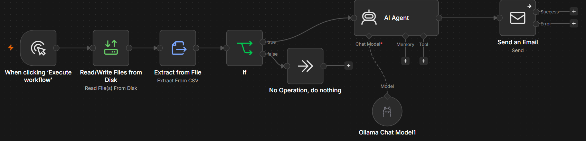

# Employee Birthday Email Automation

An AI-powered HR automation workflow that automatically sends personalized birthday emails to employees using **n8n**, **Ollama (Llama 3.2)**, **Docker**, and **SMTP**.

---

## Overview

This project automates employee birthday greetings by checking employee records daily, identifying birthdays, generating personalized messages using a locally hosted Large Language Model (LLM), and delivering the emails automatically via SMTP.

The workflow is fully containerized using Docker and does not rely on cloud AI services, making it suitable for local deployment and experimentation.

---

## Features

- Daily automated birthday checks
- Reads employee information from a CSV file
- Detects birthdays based on the current date
- Generates personalized birthday messages using Llama 3.2
- Sends emails automatically through SMTP
- Docker-based deployment
- Runs completely locally using Ollama
- Basic workflow error handling

---

## Architecture


---

## Workflow

The automation follows these steps:

1. Schedule Trigger runs every day.
2. Employee records are loaded from a CSV file.
3. The workflow checks whether today's date matches an employee's birthday.
4. If a birthday is found:
   - A personalized birthday message is generated using Ollama (Llama 3.2).
   - The email is sent using SMTP.
5. If no birthdays are found, the workflow exits.

---

## Screenshots

### n8n Workflow



### Sample Birthday Email


---

## Technologies Used

| Technology | Purpose |
|------------|---------|
| n8n | Workflow automation |
| Ollama | Local LLM runtime |
| Llama 3.2 | AI message generation |
| Docker | Containerized deployment |
| SMTP | Email delivery |
| CSV | Employee data storage |

---

## Project Structure

```text
n8n-employee-birthday-automation/
│
├── README.md
├── LICENSE
├── .gitignore
├── workflow.json
│
├── data/
│   └── sample-employees.csv
│
├── docs/
│   └── architecture.drawio
│
└── screenshots/
    ├── architecture.png
    ├── workflow.png
    └── sample-email.png
```

---

## Getting Started

### Prerequisites

- Docker Desktop
- n8n
- Ollama
- Llama 3.2 model
- SMTP email account (Gmail or equivalent)

### Setup

1. Clone the repository.

```bash
git clone https://github.com/elizabethannjoseph/n8n-employee-birthday-automation.git
```

2. Start Docker.

3. Launch the n8n container.

4. Import `workflow.json`.

5. Configure:
   - SMTP credentials
   - Ollama endpoint
   - Employee CSV file path

6. Activate the workflow.

---

## Future Improvements

- HTML email templates
- Microsoft 365 integration
- HRMS/Database integration
- Microsoft Defender and Sentinel integration
- Employee work anniversary automation
- Logging and reporting dashboard

---

## License

This project is licensed under the MIT License.

---

## Author

**Elizabeth Joseph**